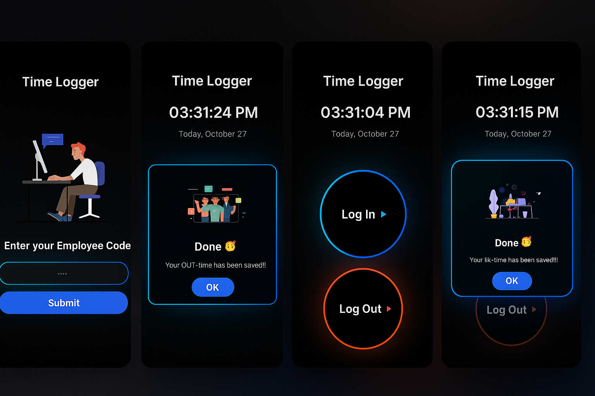

# 🕒 Daily Time Logger App

A sleek, **mobile-first Progressive Web App (PWA)** designed to simplify employee time tracking with **automatic Google Sheets integration**. Perfect for organizations looking for an easy and automated attendance solution.

---

## ✨ Features

- **🔐 Employee Time Tracking** — Simple login/logout system with employee code authentication  
- **⏰ Real-time Clock** — Displays current time and date in Toronto timezone  
- **📊 Google Sheets Integration** — Automatically logs all entries to a Google Spreadsheet  
- **🎬 Animated UI** — Engaging Lottie animations for a delightful user experience  
- **📱 Mobile-First Design** — Fully optimized for mobile devices with PWA support  
- **🌙 Dark Theme** — Modern dark mode interface with cyan/blue accents  

---

## 🧠 Tech Stack

| Category | Technology |
|-----------|-------------|
| **Framework** | Next.js 16 (App Router) |
| **Language** | TypeScript |
| **Styling** | Tailwind CSS v4 |
| **UI Components** | shadcn/ui |
| **Animations** | Lottie (lottie-web) |
| **Backend** | Google Apps Script (Google Sheets integration) |

---

## 📂 Project Structure

```bash
├── app/
│   ├── page.tsx                  # Main application logic
│   ├── layout.tsx                # Root layout with fonts
│   └── globals.css               # Global styles and tokens
├── components/
│   ├── title-bar.tsx             # App header with logo
│   ├── employee-code-entry.tsx   # Login screen
│   ├── time-display.tsx          # Clock display
│   ├── log-in-out-buttons.tsx    # Time logging buttons
│   ├── modal-popup.tsx           # Success modals
│   └── footer-status.tsx         # Footer with version info
├── lib/
│   └── google-sheets.ts          # Google Sheets API integration
├── public/
│   ├── images/                   # Image assets
│   └── animations/               # Lottie animation files
└── GOOGLE_SHEETS_SETUP.md        # Google Apps Script setup instructions
```

---

## ⚙️ Setup Instructions

### 1️⃣ Clone and Install

```bash
# Clone the repository
git clone <repository-url>

# Install dependencies
npm install

# Run development server
npm run dev
```

---

### 2️⃣ Configure Google Sheets Integration

#### Step 1: Prepare Your Google Sheet

1. Open your Google Sheet: [Your Sheet URL]  
2. Create a sheet named **"Master"**  
3. Add the following headers in Row 1:  
   - Column A: `Sr. No.`  
   - Column B: `Employee Code`  
   - Column C: `Date`  
   - Column D: `Type`  
   - Column E: `Time`  

#### Step 2: Deploy Google Apps Script

1. Go to **Extensions → Apps Script** in your Google Sheet  
2. Delete any existing code  
3. Copy the script from `GOOGLE_SHEETS_SETUP.md`  
4. Click **Deploy → New Deployment**  
5. Select **Web app** as deployment type  
6. Configure as follows:  
   - Execute as: **Me**  
   - Who has access: **Anyone**  
7. Click **Deploy** and copy the **Web App URL**  

#### Step 3: Add Environment Variable

Add your Web App URL to `.env.local`:

```bash
NEXT_PUBLIC_GOOGLE_SHEETS_URL=your-web-app-url-here
```

Or in **v0.dev**, go to **Vars** in the sidebar and add it there.

---

### 3️⃣ Run the Application

```bash
npm run dev
```

Then visit: **http://localhost:3000**

---

## 👩‍💼 Usage

### For Employees

1. **Enter Employee Code** — Enter your unique employee ID.  
2. **Log In** — Tap *“Log In”* at the start of your work shift.  
3. **Log Out** — Tap *“Log Out”* when leaving.  
4. **Confirmation** — A success modal confirms every action.  

### Time Logging Format

All times are logged in **America/Toronto** timezone using 12-hour format:  
- **Date:** MM/DD/YYYY  
- **Time:** HH:MM AM/PM  
- **Type:** “In” or “Out”  

### Google Sheets Output Example

| Sr. No. | Employee Code | Date | Type | Time |
|----------|----------------|------------|------|----------|
| 1 | 001 | 10/27/2025 | In | 9:00 AM |
| 2 | 001 | 10/27/2025 | Out | 5:30 PM |

---

## 🔑 Environment Variables

| Variable | Description | Required |
|-----------|-------------|-----------|
| `NEXT_PUBLIC_GOOGLE_SHEETS_URL` | Google Apps Script Web App URL | ✅ Yes |

---

## 🚀 Deployment

### Deploy to Vercel

1. Click the **Publish** button in v0  
2. Or push the repo to GitHub and connect it to **Vercel**  
3. Add your environment variables in Vercel dashboard  
4. Deploy! 🎉  

---

## 📲 PWA Installation

Users can install the app directly on their devices:

1. Open in a mobile browser  
2. Tap **“Add to Home Screen”**  
3. Launch it like a native app  

---

## 🧩 Troubleshooting

### 🕐 Time Not Logging
- Ensure the Google Apps Script is **deployed** (not just saved)  
- Verify `NEXT_PUBLIC_GOOGLE_SHEETS_URL` is correct  
- Confirm the sheet name is **Master**  
- Check browser console for any fetch or CORS errors  

### 🌍 Wrong Timezone
- The app uses **America/Toronto** timezone  
- Ensure browser timezone settings are correct  
- Verify Google Apps Script receives timestamp from the client request  

### 🎞️ Animations Not Loading
- Ensure Lottie JSON files are inside `/public/animations/`  
- Check console for missing file (404) errors  
- Verify animation import paths in components  

---

## 📱 Screenshots


---

## 🧾 Version

**v1.0** — Initial Release

---

## 💬 Support

For issues or suggestions, please open an issue on GitHub.

---

## 📜 License

**MIT License** — See `LICENSE` file for details.
